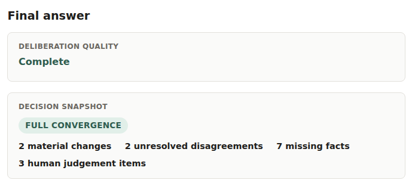
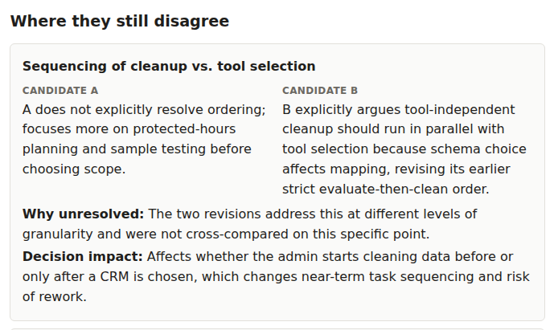
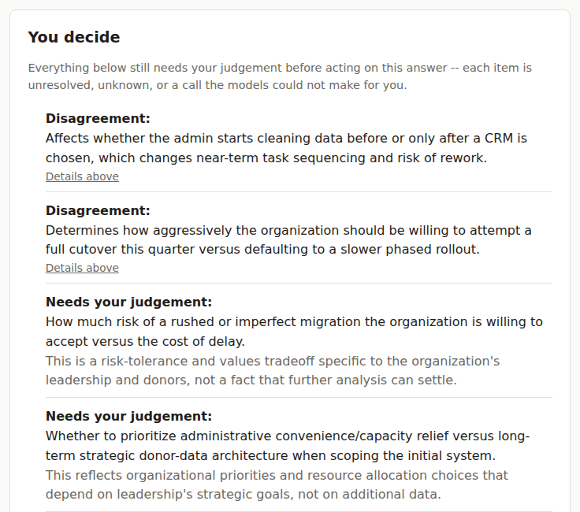

# LLM Deliberation

An AI-assisted decision-support system that keeps the reasoning behind a
recommendation visible — where independent analyses agreed or diverged,
what changed after critique, what remains unresolved, and what still needs
a human's judgement — instead of collapsing all of that into one polished
answer.

It's built for decisions that are genuinely ambiguous, where the useful
question isn't just "what does the model recommend," but where independent
analyses actually differed, what changed once each was challenged, what's
still unresolved, and what a person still has to decide.



*See the state of the deliberation before reading the final answer.*

## Why this exists

A fluent AI recommendation looks the same whether it's well-supported or
shaky. It doesn't reveal whether a differently-informed analysis would push
back, which of its claims are actually load-bearing, or which important
facts it simply doesn't have. For a quick factual lookup that's rarely a
problem. For a decision with real tradeoffs and consequences, it can hide
exactly the information a careful reviewer would want before signing off.

Re-asking the same or a different model doesn't fix this — it just produces
another single, unstructured pass, with nothing recorded about where two
independent attempts actually differed.

## What you see instead

Once a deliberation finishes, the result page opens on a **Decision
Snapshot**: the overall agreement state, how many positions materially
changed, how many disagreements are still unresolved, and how many items
need a human decision — before you read a single sentence of the answer.

Below that:

- **What changed** — specific before → after position changes, each with
  what appears to have triggered it (a peer critique, the red-team pass, or
  the model's own reassessment).
- **Where models still disagree** — unresolved disagreements shown as two
  positions side by side, not smoothed into one answer.

  

  *Disagreement stays visible instead of being silently averaged away.*

- **What's still unknown** — facts that would help resolve something,
  flagged rather than guessed at.
- **You decide** — a compact index of everything above that still needs a
  human call, so it isn't scattered across five sections.

  

  *An excerpt of the questions and judgement calls the system leaves to the human.*

- **Red-team status** — one of several distinct states (ran and referenced
  in changes, skipped, skipped for budget, failed, externally blocked) —
  never collapsed into a plain on/off.
- **Trace & provenance** — cost, retries, and which provider actually
  produced each piece, collapsed by default but one click away.

None of this claims to make a decision easier or faster to understand —
that's an open question the
[Decision Cockpit design notes](docs/design/decision-cockpit-proposal.md)
say explicitly hasn't been tested with real users yet.

## How deliberation works

1. **Independent analysis** — two different model families answer the same
   question; neither sees the other's answer.
2. **Cross-critique** — each reviews the other's reasoning for gaps,
   unsupported claims, and hidden assumptions.
3. **Optional red-team pass** — a third model looks specifically for
   assumptions or blind spots the first two might share; it never votes or
   ranks.
4. **Revision** — each candidate is revised in light of the critique (and
   the red-team report, if it ran).
5. **Convergence / change analysis** — a dedicated stage compares each
   revision to its original, and the two revisions to each other: what
   changed, what's agreed, what's still disputed.
6. **Synthesis** — a final answer is produced, informed by that comparison,
   never allowed to quietly manufacture consensus over a disagreement it
   was just told about.

Every stage above is a real, separately persisted step, not a framing
device. For the actual stage graph, provider routing, and service/
orchestrator structure, see [`docs/architecture.md`](docs/architecture.md)
and the [design decisions](docs/decisions/) behind specific choices — e.g.
why generation happens independently
([ADR 001](docs/decisions/001-independent-generation.md)), why the third
model critiques rather than votes
([ADR 002](docs/decisions/002-red-team-not-voting.md)).

## What has actually been measured

The evaluation harness runs the same question through four architectures —
a single call, two independent analyses, +critique/revision, and the full
pipeline with red-team — then has a human reviewer score each one **blind**:
the reviewer doesn't know which output came from which architecture, and
scores are locked to a file before the mapping is revealed.

The first pilot case ran all four, human-scored, and unblinded:

| Variant | Score | Cost | Calls |
|---|---|---|---|
| SINGLE | 15/16 | $0.02 | 1 |
| DUAL | 16/16 | $0.09 | 3 |
| CRITIQUE | 16/16 | $0.21 | 7 |
| FULL | 15/16 | $0.31 | 12 |

All four scored within a narrow 15–16/16 band — a ceiling effect, not a win
for any architecture. This particular case turned out to be easy enough
that extra deliberation didn't produce a clear measured advantage, and the
full pipeline cost about 17x more to run than a single call.

The first pilot did not show that more deliberation was better. All four
variants scored within a narrow range, which is exactly why the project now
has a harder evaluation case rather than treating architecture complexity
as evidence of quality.

A second, harder case (testing whether a small added constraint changes
which architecture handles it correctly) is designed and partly run:
SINGLE, DUAL, and CRITIQUE completed live. FULL has no complete result —
both attempts were externally blocked at the red-team stage by a Gemini
API access/billing restriction, not a code or model defect. Blind review
hasn't started and no comparative result exists yet.

Full methodology, locked-score discipline, and the honest limits of what
one pilot case can establish:
[`docs/verification-matrix.md`](docs/verification-matrix.md).

## Built beyond the happy path

- Durable per-stage SQLite persistence — a failure elsewhere never erases
  already-completed, already-paid-for work.
- Resume, retry, and skip for any failed or optional stage, offline-tested
  end to end.
- Provider attempts tracked separately from logical stages, so a retried or
  fallback-recovered stage is never mistaken for a simple 1:1 call.
- Cost, token, and provenance tracking per stage, not just a total at the
  end.
- Bounded, disclosed fallback for transient provider failures — never
  silent, never unbounded.
- Structured, schema-validated convergence output instead of parsed free
  text.
- A completion-reserve budget guard that protects required stages from
  optional spend before it's asked to.
- A working-language contract with one bounded corrective retry (see
  below).
- Model output sanitized to a strict HTML allowlist before rendering.
- Additive-only historical database migrations, with dedicated
  backward-compatibility tests.

648 deterministic tests currently pass, including dedicated release-gate,
evaluation, compatibility, budget, and retry/resume coverage — every
provider call is faked, so CI never needs API keys.

### What live testing actually found

- A live run hit a genuine Gemini `HTTP 500`; the fallback chain retried
  and then switched models automatically, disclosed in the UI as a
  fallback, not presented as a clean success.
- A live run later hit `HTTP 403` from Gemini — an account/billing-side
  access restriction, not a transient error. The system correctly
  classified it as non-retryable and failed cleanly with a typed reason
  instead of masking it or retrying blindly. (This is also what's
  currently blocking Case 3's FULL variant, above.)
- A live canary caught a model silently answering in the wrong working
  language on an Estonian-output run. That's what led to the current
  working-language contract: deterministic language detection plus one
  bounded corrective retry. The bug is fixed and offline-tested; the
  corrective-retry branch itself hasn't fired in a live run yet, since
  every run since the fix has matched on the first attempt.

The point isn't that the system doesn't fail — it's that live testing
surfaced real failure modes, and each one changed the engineering rather
than getting patched around.

### How claims are tracked

Every capability claim in this README is checked against
[`docs/verification-matrix.md`](docs/verification-matrix.md), which tags
each one as offline-verified (tested, no API calls), live-verified (run
against real provider APIs), historical (verified previously, not re-run
this session), evaluation evidence (observed during a scored experiment),
externally blocked, or not yet verified. A passing test is not treated as
the same thing as a live result, and neither is treated as proof the
underlying hypothesis holds.

## What this project does not claim

- Model agreement is not truth — two models agreeing is evidence they
  agree, not evidence either is right.
- A material change is not automatically an improvement — it's a recorded
  position change, shown neutrally.
- Red-team participation in a change doesn't mean it caught a real error —
  it means the convergence analysis attributed the change to red-team's
  input, which is itself a model's own attribution, not a verified fact.
- More models does not automatically mean a better answer — that's the
  exact hypothesis this project built an evaluation harness to test, not
  an assumption behind it.
- Pilot Case 1 did not establish that the full pipeline is better than a
  single call.
- The Decision Cockpit has not been tested with real users — it's designed
  for fast comprehension; whether it achieves that is untested.
- The system has not been shown to improve human decision quality, only to
  make more of the reasoning process visible.
- This is not multi-user or production infrastructure — single-user,
  single-process, local-only by design.

## Technical architecture

```
        CLI (llm-deliberate)      Browser UI (llm-deliberate-ui)
                 │                          │
                 └────────────┬─────────────┘
                              ▼
                    DeliberationService
                 create_run / start_run / resume_run /
                 retry_stage / get_run / list_runs
                              │
              ┌───────────────┴───────────────┐
              ▼                                ▼
      Repository (SQLite)              DeliberationOrchestrator
   runs / stages / artifacts           provider adapters:
   data/deliberation.db                OpenAI, Anthropic, Gemini
```

Both interfaces call the same service layer; neither talks to SQLite or the
model providers directly. FastAPI + Jinja2 + vanilla JS/CSS on the web side
(no frontend framework, no bundler); SQLite with `busy_timeout` set and
additive-only migrations on the storage side. The full stage graph,
provider routing, and per-stage retry/fallback logic:
[`docs/architecture.md`](docs/architecture.md).

## Privacy & security

This is local software, not a local model. The CLI and web UI run entirely
on your machine, but every deliberation stage is a network request to a
third-party provider's API (OpenAI, Anthropic, and optionally
Google/Gemini) — your questions and generated text leave your machine.
"Local-first" describes where the orchestration and database run, not
where inference happens.

- API keys are read from `.env`/environment only — never written to
  SQLite, never in exports, never sent to the browser, never logged.
- The web UI has no authentication and binds to `127.0.0.1` only — built
  for single-user local use.
- Model output is rendered through a Markdown parser and then a strict
  HTML allowlist (`nh3`) before display — a model producing adversarial
  HTML/script content can't get it to execute. The stored artifact and
  Markdown export are always the original, unmodified text.
- No analytics, no telemetry, no external CDN dependencies.
- SQLite and Markdown files are unencrypted local files — anyone with
  filesystem access can read them.

Full detail: [`docs/trust-model.md`](docs/trust-model.md) and
[`SECURITY.md`](SECURITY.md).

## Run locally

Requires Python 3.11+ and API keys for OpenAI and Anthropic (Gemini only
if you use the red-team stage). **Primary tested setup: Windows 11 + WSL2
(Ubuntu).** Other environments may work but aren't as thoroughly tested.

There's no hosted demo — `http://127.0.0.1:8765` below is a local address
that only resolves while you're running the server yourself.

### Windows (WSL2 Ubuntu)

Open an **Ubuntu/WSL terminal** — not PowerShell — and run:

```bash
git clone https://github.com/kadrik6/llm-deliberation.git
cd llm-deliberation

python3 -m venv .venv
source .venv/bin/activate

pip install -e .

cp .env.example .env
# edit .env and add OPENAI_API_KEY / ANTHROPIC_API_KEY / (optional) GEMINI_API_KEY

llm-deliberate-ui
```

Then open your normal **Windows** browser at `http://127.0.0.1:8765` —
WSL2 forwards the port automatically. No WSL2 yet?
[Microsoft's install guide](https://learn.microsoft.com/windows/wsl/install).

### Other environments

```bash
git clone https://github.com/kadrik6/llm-deliberation.git
cd llm-deliberation

python -m venv .venv
source .venv/bin/activate        # macOS / Linux
# .venv\Scripts\Activate.ps1     # native Windows PowerShell (untested)

pip install -e ".[dev]"

cp .env.example .env
# edit .env and add your API keys
```

**CLI:**

```bash
llm-deliberate --profile economy --no-red-team \
  "Should a small team build this product now, delay it, or reject it?"
```

**Web UI:**

```bash
llm-deliberate-ui
# then open http://127.0.0.1:8765
```

**Supported deployment: exactly one worker process.** The resume/retry
guard and the provider-readiness cache are in-process memory, not shared
state — do not run this behind `--workers N>1` or multiple replicas
sharing one database file.

### Profiles

| Profile | What it means |
|---|---|
| Economy | Fastest/cheapest — routine deliberation |
| Balanced | Stronger models for important questions |
| Max | Highest-quality configuration for difficult decisions |

Maps to specific OpenAI/Anthropic/Gemini model IDs in
`src/llm_deliberation/config.py`, overridable via `.env`.

### Bilingual support

The web UI supports English and Estonian as two independent settings: the
**UI language** (interface labels — a cookie, never inferred from a run)
and the **run/output language** (what every model-generated stage of that
run is written in — chosen per run, persisted with it). The question you
type is never translated or rewritten, and there's no automatic language
detection — output language is always an explicit choice. Full detail:
[ADR 007](docs/decisions/007-bilingual-support.md),
[ADR 008](docs/decisions/008-working-language.md).

## Further reading

- [`docs/verification-matrix.md`](docs/verification-matrix.md) — what's
  offline-tested, live-verified, evaluated, or still unproven, capability
  by capability.
- [`docs/flagship-case-study-audit.md`](docs/flagship-case-study-audit.md)
  — the positioning and evidence audit this README is based on.
- [`docs/design/decision-cockpit-proposal.md`](docs/design/decision-cockpit-proposal.md)
  — the result-page UI's design reasoning and implementation status.
- [`docs/why-deliberation.md`](docs/why-deliberation.md) — the reasoning
  behind the pipeline, and what it doesn't establish.
- [`docs/architecture.md`](docs/architecture.md) — how the code is
  actually organized.
- [`docs/decisions/`](docs/decisions/) — architecture decision records for
  specific design choices.
- [`docs/trust-model.md`](docs/trust-model.md) /
  [`SECURITY.md`](SECURITY.md) — privacy and security detail.

## Project status

Experimental / pre-1.0, functionally working — CLI and web UI both
live-tested against real OpenAI/Anthropic/Gemini calls, 648 offline tests
passing. Single-user, single-process by design, not hardened for
multi-user or networked deployment. One evaluation case is complete (Pilot
Case 1, above); a second, harder case is in progress and partly blocked
externally (Case 3, above). See
[`docs/verification-matrix.md`](docs/verification-matrix.md) for exactly
what's verified and what isn't.

### Roadmap

- A small JSON API alongside the HTML routes, so a future editor extension
  or launcher can use `DeliberationService` directly.
- Windows launcher (not started).
- Structured/JSON stage outputs for machine-checkable claims.
- Citation/evidence retrieval before synthesis.
- Configurable retention policy for stored runs.
- Read-only public demo mode (hosted, replays stored example runs — no
  API keys, no live calls, no new-question form).

## Development

```bash
pip install -e ".[dev]"
pytest -q                    # offline: every provider call is faked, no API keys needed
python -m compileall -q src
```

CI (`.github/workflows/tests.yml`) runs the same suite on every push and
pull request and never requires or uses real provider API keys.

## License

[MIT](LICENSE)
